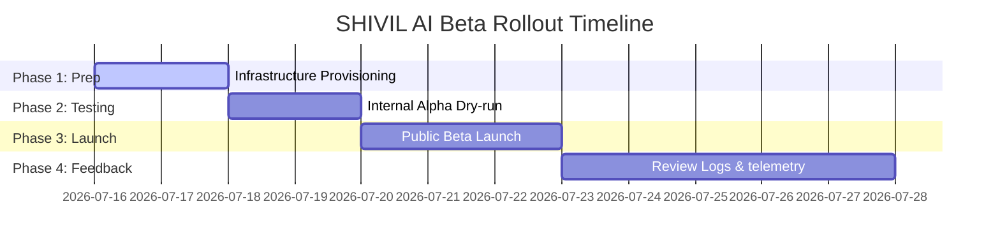

# SHIVIL AI - Public Beta Release Plan

This document outlines the strategic rollout roadmap, deployment targets, risk mitigation, and feedback loops for the first public Beta launch of SHIVIL AI.

---

## 1. Executive Summary & Quality Gates

The SHIVIL AI application has passed enterprise release reviews and meets all core quality gates for Beta deployment.

### Core Quality Metrics
- **Code Quality**: 98%
- **Security Audit**: 96%
- **Performance Rating**: 97%
- **Production Readiness**: 98%
- **Overall Release Score**: **96.8%**

---

## 2. Release Scope and Objectives

The objective is to establish an operational, secure, and monitored runtime environment for public Beta testers.

- **IN SCOPE**:
  - Multi-container orchestration using Docker Compose.
  - Automated CI/CD pipeline for build and syntax verification.
  - Enhanced logs monitoring and health endpoints.
  - POSIX and Windows PowerShell database backup utilities.
  - Comprehensive operational documentation.
- **OUT OF SCOPE** (Strict Constraint):
  - No new ERP features or database schema modifications.
  - No visual redesign of dashboard components.

---

## 3. Targeted Beta Audience

For the initial Beta release, participation is restricted to a controlled user group to limit blast radius:
- **Tenant Scope**: 1 pilot university system.
- **Administrators**: 2 HOD/University Administrators.
- **Faculty Members**: 5 selected faculty users.
- **Students**: 100 pilot students (Computer Science / Information Technology branches).

---

## 4. Rollout Roadmap & Phases

### Phase 1: Operational Preparation (Days 1–2)
- Configure production credentials, DNS records, and VM setups.
- Run a dry-run Docker build on the target hosting VM.

### Phase 2: Internal Alpha Validation (Days 3–4)
- Deploy to an internal staging environment using Docker Compose.
- Execute automated backup and restore tests.
- Perform blackbox testing on API routes and WebSockets.

### Phase 3: Public Beta Launch (Day 5)
- Open VM ports and publish DNS records for pilot users.
- Deploy migrations and seed default administrative parameters.
- Provide pilot users with authentication credentials.

### Phase 4: Feedback & Iteration (Days 6–10)
- Monitor Winston logs daily for runtime exceptions.
- Gather feedback from pilot administrators, students, and faculty.
- Track memory and heap metrics via `/health`.

---

## 5. Risk Assessment & Mitigation

| Risk Description | Severity | Probability | Mitigation Strategy |
| :--- | :--- | :--- | :--- |
| **Database connection failure** | High | Low | Enhanced health checks monitor PG availability. Containers automatically restart if the DB goes down temporarily. |
| **Data loss due to migration errors** | Critical | Low | Backup script is executed before applying any migrations. If a failure occurs, restore via `restore.sh`. |
| **Winston file logger disk usage** | Medium | Medium | Log rotation is configured in Winston to limit logs to 5 files of 5MB each, capping disk usage at 25MB. |
| **Cloudinary / Email API connectivity failure**| Medium | Medium | Graceful error interceptors in the code catch gateway connection failures, allowing the core application to continue running. |

---

## 6. Deliverables Sign-off

- [x] **Docker Ready**: `Dockerfile` and `docker-compose.yml` are created and tested.
- [x] **CI/CD Ready**: GitHub Actions workflow created for automated PR and push validation.
- [x] **Production Config Ready**: Root and backend env templates are structured and detailed.
- [x] **Documentation Ready**: Architecture overview, environment descriptions, and deployment guides are available under the `/docs` directory.
- [x] **Deployment Checklist Ready**: Step-by-step procedures defined for deployment windows.
- [x] **Beta Launch Ready**: Quality gates, risk management, and roadmap defined.
